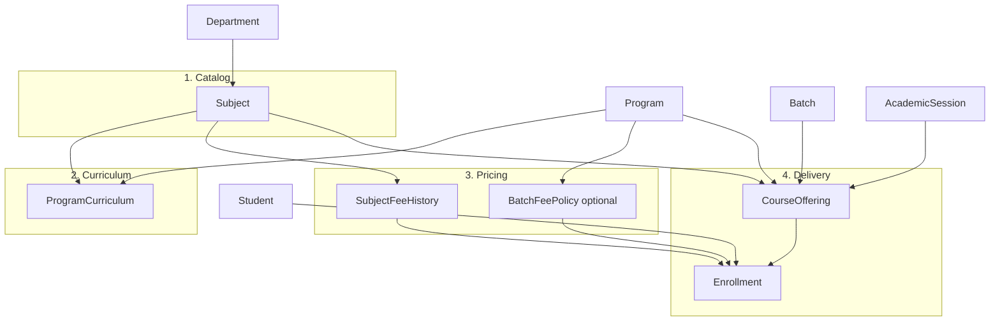

# Academic Architecture Plan — Subjects, Curriculum, Fees & Offerings

> **Status:** Phase 1–3 implemented (Subject catalog + ProgramCurriculum + SubjectFeeHistory) — Phase 4+ pending  
> **Replaces:** The current monolithic `Course` model approach (gradual migration)  
> **Last updated:** 2026-08-29  
> **UX note:** UI should group by user mental model (program, semester, fee scope) — see `maincontext.md` design principles.

---

## Why change?

The current `Course` model mixes four concerns in one document:

| Concern | Meaning | Problem today |
|---------|---------|---------------|
| **Subject (catalog)** | What exists academically (CSC101, 3 credits) | Duplicated per program/semester |
| **Curriculum** | Which subjects belong to which program & semester | Baked into `Course.programId` + `semester` |
| **Offering** | A class actually running this session (instructor, schedule) | Mixed with catalog fields |
| **Fee** | What it costs | Stored on `Course` with **no history**; changes overwrite past data |

This plan separates those layers so billing, curriculum, and delivery stay correct over time.

---

## Target hierarchy

```
University
  └── Campus
        └── Faculty
              └── Department
                    ├── Subject                    ← catalog (create first)
                    ├── Program
                    │     └── ProgramCurriculum    ← subject × program × semester
                    ├── SubjectFeeHistory          ← fee versions over time
                    └── CourseOffering             ← running class (batch + session)
                          └── Enrollment
                                └── feeSnapshot    ← locked fee for that registration

Teacher  → assigned to CourseOffering
Student  → belongs to Program + Batch → Enrollments on offerings
```



---

## Layer 1 — Subject (catalog)

**Create subjects first.** One row per academic subject, owned by a department, reusable across programs.

### Model: `Subject`

| Field | Type | Notes |
|-------|------|-------|
| `subjectId` | String | Display ID, e.g. `SUB-0001` |
| `code` | String | e.g. `CSC101` — unique (global or per department — see decisions) |
| `name` | String | e.g. Programming Fundamentals |
| `departmentId` | ObjectId → Department | Required |
| `credits` | Number | Credit hours |
| `description` | String | Optional |
| `prerequisiteSubjectIds` | ObjectId[] → Subject | Optional |
| `status` | Active \| Inactive | |
| `isDeleted`, `deletedAt`, `deletedBy` | | Soft delete |

### API / UI

- `GET/POST /api/subjects`, `GET/PUT/DELETE /api/subjects/:id`
- Frontend: `/subjects`, `/subjects/create`, `/subjects/edit/:id`
- Pattern: same lean CRUD as Department / Program

---

## Layer 2 — ProgramCurriculum

**Maps subjects into a degree plan** — “BSCS semester 3 includes CSC201 as Core.”

### Model: `ProgramCurriculum`

| Field | Type | Notes |
|-------|------|-------|
| `programId` | ObjectId → Program | Required |
| `subjectId` | ObjectId → Subject | Required |
| `semester` | Number | 1..N (within program duration) |
| `type` | Core \| Elective \| Optional | |
| `order` | Number | Display order in semester plan |
| `status` | Active \| Inactive | |

**Indexes:** unique `{ programId, subjectId }`; index `{ programId, semester }`

### API / UI

- `GET /api/programs/:id/curriculum` — full semester grid
- `PUT /api/programs/:id/curriculum` — replace or patch semester assignments
- UI: curriculum tab on Program edit page, or `/programs/:id/curriculum`

---

## Layer 3 — SubjectFeeHistory

**Fee is versioned, never overwritten.**

### Model: `SubjectFeeHistory`

| Field | Type | Notes |
|-------|------|-------|
| `subjectId` | ObjectId → Subject | Required |
| `programId` | ObjectId → Program | Optional — `null` = default for all programs |
| `feePerCredit` | Number | |
| `feeType` | Tuition \| Lab \| … | |
| `effectiveFrom` | Date | When this rate starts |
| `effectiveTo` | Date \| null | `null` = currently active row |
| `changedBy` | ObjectId → User | |
| `reason` | String | e.g. “Board approval 2026-01” |

**Rules:**

- Adding a new rate **closes** the previous row (`effectiveTo = day before new effectiveFrom`).
- **Current rate** for a subject (and optional program) = row where `effectiveTo` is null.
- **Rate at date D** = row where `effectiveFrom <= D` and (`effectiveTo` is null or `effectiveTo >= D`).

### API / UI

- `GET /api/subjects/:id/fees` — full history timeline
- `POST /api/subjects/:id/fees` — add new rate (Admin)
- `GET /api/subjects/:id/fees/current?programId=` — resolve applicable rate today

---

## Layer 4 — CourseOffering

**A running instance** of a subject for a specific batch and academic session.

### Model: `CourseOffering`

| Field | Type | Notes |
|-------|------|-------|
| `offeringId` | String | e.g. `OFF-0001` |
| `subjectId` | ObjectId → Subject | Required |
| `programId` | ObjectId → Program | Required |
| `batchId` | ObjectId → Batch | Required |
| `academicSessionId` | ObjectId → AcademicSession | Required |
| `semester` | Number | Program semester number |
| `instructorId` | ObjectId → Teacher | Optional |
| `schedule` | Object | day, times, room |
| `capacity` | Number | |
| `enrolledStudents` | Number | Denormalized count |
| `status` | Active \| Completed \| Cancelled \| Draft | |

**No fee fields on offering** — fee is resolved at enrollment time from `SubjectFeeHistory` (+ policy).

Assignments, Attendance, Exams should reference `offeringId` (keep denormalized `subjectCode` only for reports).

---

## Layer 5 — Enrollment & feeSnapshot

### Model: `Enrollment`

| Field | Type | Notes |
|-------|------|-------|
| `studentId` | ObjectId → Student | |
| `offeringId` | ObjectId → CourseOffering | |
| `enrolledAt` | Date | |
| `status` | Enrolled \| Dropped \| Completed \| Withdrawn | |
| `feeSnapshot` | Object | **Immutable after billing** — see below |
| `feePolicyApplied` | String | Which rule was used — see fee policies |

### feeSnapshot structure

```js
feeSnapshot: {
  subjectFeeHistoryId,   // row that was used
  feePolicy,             // e.g. "current_rate" | "batch_locked" | "manual_adjustment"
  credits,
  feePerCredit,
  totalFee,
  feeType,
  academicSessionId,
  lockedAt,              // when snapshot was taken (registration time)
}
```

---

## Fee policies — snapshots vs future increases

### What feeSnapshot protects

`feeSnapshot` is **per enrollment** (per subject per semester), not per student for life.

- When a student registers for **Semester 1, Fall 2024**, the system reads `SubjectFeeHistory` as of registration date and stores that in `feeSnapshot`.
- That invoice/challan for Semester 1 **never changes** when 2026 rates are published.
- Historical reports and paid fees stay correct.

### What happens when fees increase for continuing students?

**Normal case (most universities):** each **new semester registration** gets a **new** `feeSnapshot` using the rate effective on **that registration date**.

| Event | What happens |
|-------|----------------|
| Student enrolled Sem 1 (2024) | Snapshot @ 2024 rates → billed, locked |
| University raises fees for 2026 | New `SubjectFeeHistory` rows with `effectiveFrom` e.g. Spring 2026 |
| Same student registers Sem 5 (2026) | **New** enrollment → **new** snapshot @ 2026 rates |
| Sem 1 bill | Unchanged — still 2024 snapshot |

So: **past semesters are frozen; upcoming semesters use upcoming rates** unless a grandfathering policy says otherwise.

### Optional: BatchFeePolicy (grandfathering)

Some institutions lock fees for an entire intake batch.

### Model: `BatchFeePolicy` (optional)

| Field | Type | Notes |
|-------|------|-------|
| `batchId` | ObjectId → Batch | e.g. Batch 2024 |
| `policy` | `current_rate` \| `intake_locked` \| `hybrid` | |
| `lockedFeeScheduleId` | ObjectId | Reference to frozen fee structure for intake year |
| `effectiveFrom` | Date | |
| `notes` | String | |

| Policy | Behavior |
|--------|----------|
| **`current_rate`** (default) | Each new enrollment uses `SubjectFeeHistory` effective at registration date |
| **`intake_locked`** | All semesters for that batch use rates from admission year (2024 schedule forever) |
| **`hybrid`** | Tuition locked at intake; lab/misc fees follow current rates |

**Resolution order at registration:**

1. Check `Student` override (scholarship / special case) if any  
2. Check `BatchFeePolicy` for student's batch  
3. Else use `SubjectFeeHistory` at registration date (+ optional `programId` override)

Store `feePolicyApplied` on enrollment so audits show *why* that amount was used.

### Mid-semester increases (rare)

If board approves a fee hike **after** students already registered:

| Approach | Use when |
|----------|----------|
| **Do not change** existing `feeSnapshot` | Default — already billed |
| **Supplemental charge** | New `FeeAdjustment` record (+amount, reason, linked to `enrollmentId`) for difference |
| **Credit** | Negative adjustment if fee was reduced |

### Model: `FeeAdjustment` (optional, for exceptions)

| Field | Type |
|-------|------|
| `studentId` | ObjectId |
| `enrollmentId` | ObjectId (optional) |
| `amount` | Number (+ or -) |
| `reason` | String |
| `approvedBy` | ObjectId → User |
| `effectiveDate` | Date |

---

## Fee flow summary (diagram)

```
Registration opened for Spring 2026
        │
        ▼
Resolve fee policy (Student → Batch → default current_rate)
        │
        ▼
For each subject offering: lookup SubjectFeeHistory @ registration date
        │
        ▼
Create Enrollment with feeSnapshot (immutable)
        │
        ▼
Generate Fee / Challan from feeSnapshot (+ FeeAdjustments if any)
        │
        ▼
Payment recorded against that challan — never recalculate old enrollments
```

---

## Relationship to existing models

| Current | Future |
|---------|--------|
| `Course` (monolith) | Split → `Subject` + `ProgramCurriculum` + `CourseOffering` |
| `Course.feePerCredit` | → `SubjectFeeHistory` |
| `FeeStructure.courses[]` (embedded strings) | → built from curriculum + fee history, or generated per session |
| `Assignment.courseCode` | → `offeringId` + denormalized `subjectCode` |
| `Exam.courseCode` | → same |
| `Student.coursesEnrolled[]` | → `Enrollment` collection |

---

## Migration phases

| Phase | Work | Risk |
|-------|------|------|
| **1** | `Subject` model + CRUD + `/subjects` UI | Low — additive |
| **2** | `ProgramCurriculum` + program curriculum UI | Low |
| **3** | `SubjectFeeHistory` + fee timeline UI | Low |
| **4** | Migrate unique `Course.code` → `Subject`; map program+semester → `ProgramCurriculum` | Medium |
| **5** | `CourseOffering` + `Enrollment` with `feeSnapshot` | Medium |
| **6** | Wire Assignments / Exams / Attendance to `offeringId` | Higher |
| **7** | Optional `BatchFeePolicy`, `FeeAdjustment` | As needed |
| **8** | Deprecate old `Course` model | After full migration |

**Do not** refactor the large `CoursesPage` on the old model — build Subject + Curriculum first.

---

## API shape (lean, consistent with Department / Program)

### Subjects

| Method | Path |
|--------|------|
| GET | `/api/subjects` |
| GET | `/api/subjects/stats` |
| GET | `/api/subjects/:id` |
| POST | `/api/subjects` |
| PUT | `/api/subjects/:id` |
| DELETE | `/api/subjects/:id` |
| GET | `/api/subjects/:id/fees` |
| POST | `/api/subjects/:id/fees` |

### Program curriculum

| Method | Path |
|--------|------|
| GET | `/api/programs/:id/curriculum` |
| PUT | `/api/programs/:id/curriculum` |

### Offerings & enrollment

| Method | Path |
|--------|------|
| GET | `/api/offerings` |
| POST | `/api/offerings` |
| PUT | `/api/offerings/:id` |
| POST | `/api/offerings/:id/enroll` |
| DELETE | `/api/offerings/:id/enroll/:studentId` |

---

## Open decisions (confirm before Phase 1)

| # | Question | Options |
|---|----------|---------|
| 1 | Subject `code` unique scope | **Global** (recommended) vs per department |
| 2 | Default fee policy for new batches | `current_rate` vs `intake_locked` |
| 3 | Program-specific fee override | Yes (`programId` on `SubjectFeeHistory`) vs subject-only |
| 4 | UI naming | Admin: “Subjects”; student portal: can still say “Courses” |
| 5 | Route for offerings | `/offerings` vs keep `/courses` as alias for offerings |

---

## Glossary

| Term | Meaning |
|------|---------|
| **Subject** | Master catalog entry — what can be taught |
| **Program curriculum** | Which subjects belong to which program semester |
| **Subject fee history** | Versioned fee rates for a subject over time |
| **Course offering** | One running class (subject + batch + session + instructor) |
| **Enrollment** | Student registered in one offering |
| **feeSnapshot** | Fee amounts frozen at registration for that enrollment |
| **Batch fee policy** | Optional rule: continuing students follow intake rates or current rates |

---

## References

- Current hierarchy notes: `maincontext.md`
- Backend conventions: `backend/backendcontext.md`
- Frontend patterns: `frontend/frontendcontext.md`
