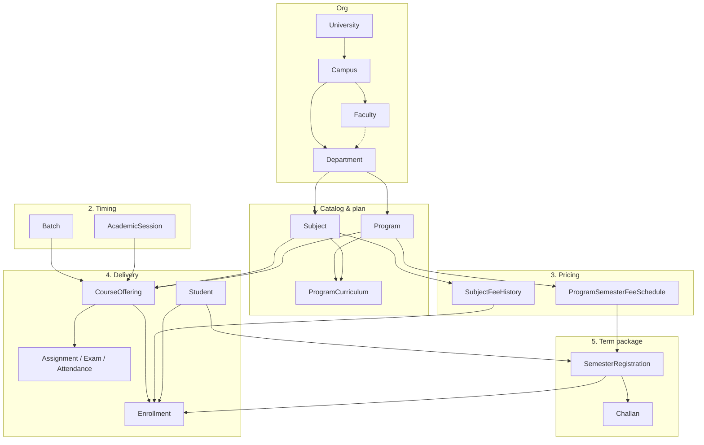

# Academic Architecture Plan — Subjects, Curriculum, Fees & Offerings

> **Status:** Phases **1–6** + Fee **F2–F5** staff paths implemented  
> **Phase 6 done (Sep 2026):** Assignments / Exams / Attendance store `offeringId` (staff modules)  
> **See also:** `maincontext.md` (master roadmap), `fee-plan.md` (sessions / batches / fees)  
> **Seed:** `npm run seed:all` → academic structure → staff/students (session + batches) → offerings/assessments  
> **Last updated:** 2026-09-28  

---

## Verdict: is this hierarchy OK?

**Yes — keep it.** It matches how real universities work and matches what the product already ships.

| Layer | Role | Change? |
|-------|------|---------|
| University → Campus → Faculty → Department | Org chart | Keep (multi-campus faculty/dept already supported) |
| Subject | Catalog (“what exists”) | Keep |
| Program + Curriculum | Degree plan | Keep |
| Batch + Academic Session | Who / when | Keep — **document as first-class**, not buried |
| Course Offering | Running class | Keep — hub for teaching |
| Enrollment | Student in one class | Keep |
| Semester Registration | Student in a **whole term** + package fee | Keep — **clarify** it sits beside offerings, not under “Enrollment only” |
| Assignments / Exams / Attendance | Teaching ops | Keep — always via `offeringId` |

### What we should **not** do

- Do **not** merge Subject + Offering again (that was the old `Course` mistake).
- Do **not** put fees on Offering.
- Do **not** make attendance unique only on `{ student, date }` (class-level is correct).

### Clarity improvements (docs / UI naming — not schema rewrites)

1. **Split “structure” vs “delivery”** in nav mental model: catalog/plan first, then session/batch/offerings, then registrations.
2. **Say explicitly:** Semester Registration **creates/uses** Enrollments; Enrollment is the seat in a class; Registration is the term enrollment + bill.
3. **Teacher** = `StaffMember` (`isAcademic`) on `CourseOffering.instructorId` — no separate Teacher model.
4. Optional later (Phase 7+): `BatchFeePolicy`, gradebook ObjectId cleanup, student-portal grades/attendance.

---

### Clarity improvements (UX — not schema)

We improve clarity by **naming and copy**, not by changing models:

1. **Sidebar grouping** — Sessions / Batches / Offerings / Semester Registrations under **Term & Classes**; teaching under **Teaching**.
2. **Precise labels** — “Course Offerings”, “Semester Registrations”, “Academic Sessions”.
3. **Page intros** — one sentence that states what the page is *and* what it is not (Registration ≠ single-class Enrollment).
4. **Instructor copy** — “Academic staff from Staff Directory” (no separate Teacher list).

Do **not** rename Mongo collections or routes for polish — keep `/offerings`, `/semester-registrations`, etc.

---

## Why this shape exists

The old monolithic `Course` mixed four concerns. Those are now separated:

| Concern | Model | Meaning |
|---------|--------|---------|
| **Catalog** | `Subject` | What can be taught (CS-101, 3 credits) |
| **Plan** | `ProgramCurriculum` | Which subjects in which program semester |
| **Delivery** | `CourseOffering` | Class running this session for a batch |
| **Seat** | `Enrollment` | Student in that class + subject fee snapshot |
| **Term** | `SemesterRegistration` | Student registered for a semester package + challan |
| **Fee history** | `SubjectFeeHistory` / `ProgramSemesterFeeSchedule` | Rates over time / package lines |

---

## Target hierarchy (current)

```
University
  └── Campus
        ├── Faculty                 ← campusIds[] + campusAssignments[]
        └── Department              ← campusIds[] + facultyIds[] + campusAssignments[]
              ├── Subject                      ← catalog
              ├── Program
              │     ├── ProgramCurriculum      ← subject × program × semester
              │     └── ProgramSemesterFeeSchedule  ← semester package (F2)
              ├── SubjectFeeHistory            ← per-subject fee versions
              ├── Batch                        ← intake (BSCS-2024)
              ├── AcademicSession              ← term (Fall 2025)
              │
              ├── CourseOffering               ← running class (subject + batch + session)
              │     ├── Enrollment             ← student in class + feeSnapshot
              │     ├── Assignment             ← offeringId (+ denormalized refs)
              │     ├── Exam                   ← offeringId
              │     └── Attendance             ← offeringId (unique student+date+offering)
              │
              └── SemesterRegistration         ← student × program × semester × session
                    ├── semesterFeeSnapshot
                    ├── challan (Fee) via generate-challan
                    └── enrollments into that term’s offerings

StaffMember (academic)  → CourseOffering.instructorId
Student                 → Program + Batch → SemesterRegistration and/or Enrollments
```



---

## Layer 1 — Subject (catalog)

One row per academic subject, owned by a department, reusable across programs.

| Field | Notes |
|-------|--------|
| `subjectId`, `code`, `name` | Display + unique code (global) |
| `departmentId` | Required |
| `credits`, `prerequisiteSubjectIds`, `status` | |
| Soft delete | `isDeleted` / `deletedAt` / `deletedBy` |

**UI:** `/subjects`

---

## Layer 2 — ProgramCurriculum

Maps subjects into a degree plan (“BSCS semester 3 includes CS-201 as Core”).

| Field | Notes |
|-------|--------|
| `programId`, `subjectId`, `semester` | Required |
| `type` | Core \| Elective \| Optional |
| `order`, `status` | |

**UI:** `/programs/:id/curriculum`

---

## Layer 3 — Fees

### SubjectFeeHistory

Versioned per-subject rates (`feePerCredit`, `effectiveFrom` / `effectiveTo`, optional `programId` override). Never overwrite; close previous row when adding a new rate.

### ProgramSemesterFeeSchedule (F2)

Semester **package** lines (subjects + lab/exam/misc) for billing Mode 2.

### Resolution at enrollment

1. Student override (scholarship) if any  
2. Optional future `BatchFeePolicy`  
3. Else `SubjectFeeHistory` at registration date (+ program override)

Store `feePolicyApplied` on Enrollment for audit.

---

## Layer 4 — CourseOffering

Running instance of a subject for a **batch** + **academic session**.

| Field | Notes |
|-------|--------|
| `offeringId` | Display `OFF-0001` |
| `subjectId`, `programId`, `batchId`, `academicSessionId`, `semester` | Required |
| `instructorId` | → **StaffMember** (academic) |
| `schedule`, `capacity`, `enrolledStudents`, `status` | |

**No fee fields on offering.** Fee locks on Enrollment (and/or SemesterRegistration package).

**Teaching children (Phase 6):** Assignment, Exam, Attendance store Mongo `offeringId` plus denormalized `subjectId` / `programId` / `batchId` / `academicSessionId` and legacy string fields for reports.

**Attendance uniqueness:** `{ studentId, date, offeringId }` (partial, not deleted) — same student can have multiple classes same day.

**UI:** `/offerings`

---

## Layer 5 — Enrollment & feeSnapshot

| Field | Notes |
|-------|--------|
| `studentId`, `offeringId` | |
| `status` | Enrolled \| Dropped \| Completed \| Withdrawn |
| `feeSnapshot` | Immutable after billing |
| `feePolicyApplied` | Audit |

```js
feeSnapshot: {
  subjectFeeHistoryId,
  feePolicy,       // e.g. "current_rate"
  credits,
  feePerCredit,
  totalFee,
  feeType,
  academicSessionId,
  lockedAt,
}
```

Past enrollments stay frozen when rates rise; **new** semester registrations get **new** snapshots.

---

## Layer 6 — SemesterRegistration (term package)

Registers a student for a **whole program semester** in a session:

1. Locks `semesterFeeSnapshot` from `ProgramSemesterFeeSchedule`
2. Ensures enrollments into Active offerings for that curriculum semester
3. Can `generate-challan` for net payable

| | Offering / Enrollment | Semester Registration |
|--|----------------------|------------------------|
| Scope | One class | Full term |
| Fee | Per-subject snapshot | Package snapshot |
| Typical user | Faculty / registrar class ops | Registrar / finance |

**UI:** `/semester-registrations`

---

## Fee flow (summary)

```
Open registration for Fall 2025
        │
        ▼
SemesterRegistration (package snapshot)     and/or     per-offering Enrollment
        │                                                    │
        ▼                                                    ▼
Generate challan from package                    feeSnapshot from SubjectFeeHistory
        │
        ▼
Payment against challan — never recalculate old snapshots
```

Optional later: `BatchFeePolicy`, `FeeAdjustment`.

---

## Relationship to removed / legacy models

| Legacy | Now |
|--------|-----|
| `Course` monolith | **Removed** → Subject + Curriculum + Offering |
| `Course.feePerCredit` | `SubjectFeeHistory` |
| `Assignment` / `Exam` string-only course | `offeringId` + denormalized strings |
| Attendance unique `{ student, date }` | `{ student, date, offeringId }` |
| Separate Teacher model | `StaffMember` + `instructorId` on offering |

---

## Migration / delivery phases

| Phase | Work | Status |
|-------|------|--------|
| **1** | Subject CRUD + `/subjects` | ✅ |
| **2** | ProgramCurriculum UI | ✅ |
| **3** | SubjectFeeHistory + fee UI | ✅ |
| **4** | Legacy Course migrate | ⏭ Skipped — `npm run seed:academic` |
| **5** | CourseOffering + Enrollment | ✅ |
| **5b** | Semester fee schedule + SemesterRegistration + challan (F2–F5) | ✅ |
| **6** | Assignments / Exams / Attendance → `offeringId` | ✅ Staff (Sep 2026) |
| **7** | BatchFeePolicy, FeeAdjustment | 📋 Future |
| **8** | Course deprecation | ✅ Done |

**Follow-ups (not hierarchy changes):** student portal grades/attendance; gradebook `Exam.grades.studentId` ObjectId cleanup; BatchFeePolicy.

---

## Seed (how demo data is built)

| Command | Creates |
|---------|---------|
| `npm run seed:all` | Roles → admin → subjects/curriculum/fees → **session + batches** + people → **offerings + enrollments + assignments/exams/attendance** → test users |
| `npm run seed:academic` | Structure + catalog only |
| `npm run seed:offerings` | Offerings / enrollments / assessments only (needs prior steps) |
| `npm run seed:backfill-offerings` | One-time link old Assignment/Exam rows |
| `npm run seed:sync-attendance-indexes` | Drop legacy attendance unique index |

---

## API shape (core)

### Subjects / curriculum / fees

| Method | Path |
|--------|------|
| CRUD | `/api/subjects`, `/api/subjects/:id/fees` |
| | `/api/programs/:id/curriculum` |

### Offerings & enrollment

| Method | Path |
|--------|------|
| CRUD | `/api/offerings` |
| | `/api/offerings/:id/enrollments` |
| | `POST /api/offerings/:id/enroll` |

### Semester registration

| Method | Path |
|--------|------|
| | `GET/POST /api/semester-registrations` |
| | `POST /api/semester-registrations/preview` |
| | `POST /api/semester-registrations/:id/generate-challan` |

### Teaching (offering-linked)

| Method | Path |
|--------|------|
| | `/api/assignments` (`offeringId` required on create) |
| | `/api/exams` |
| | `/api/attendance/students?offeringId=` |
| | `POST /api/attendance/mark` (`offeringId` required) |

---

## Open decisions (resolved / remaining)

| # | Question | Status |
|---|----------|--------|
| 1 | Subject `code` unique scope | **Global** (in use) |
| 2 | Default fee policy | **`current_rate`** |
| 3 | Program-specific fee override | **Yes** (`programId` on fee history) |
| 4 | UI: “Subjects” vs student “Courses” | Subjects in admin; portal can say Courses |
| 5 | Offerings route | **`/offerings`** (legacy `/courses` removed) |
| 6 | Attendance grain | **Per offering** ✅ |
| 7 | Instructor model | **StaffMember** ✅ |

---

## Glossary

| Term | Meaning |
|------|---------|
| **Subject** | Catalog entry — what can be taught |
| **Program curriculum** | Degree plan by semester |
| **Batch** | Intake cohort (e.g. BSCS-2024) |
| **Academic session** | Calendar term (e.g. Fall 2025) |
| **Course offering** | One running class |
| **Enrollment** | Student in one offering + subject fee snapshot |
| **Semester registration** | Student registered for a full semester package |
| **feeSnapshot** | Fee frozen at registration time |
| **Batch fee policy** | Optional grandfathering (future) |

---

## References

- Master context: `maincontext.md`
- Fee strategy: `fee-plan.md`
- Next queue: `next-steps.md`
- Backend / frontend notes: `backend/backendcontext.md`, `frontend/frontendcontext.md`
