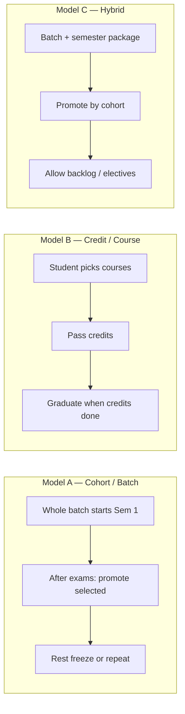
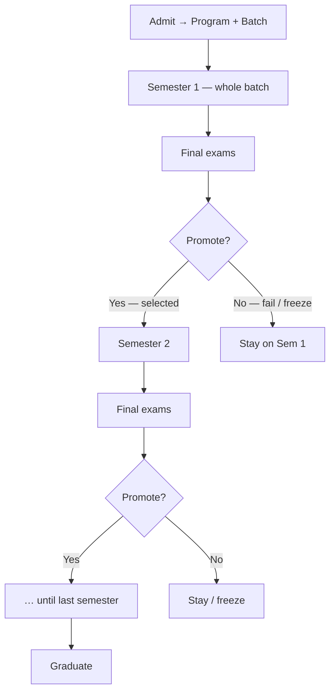
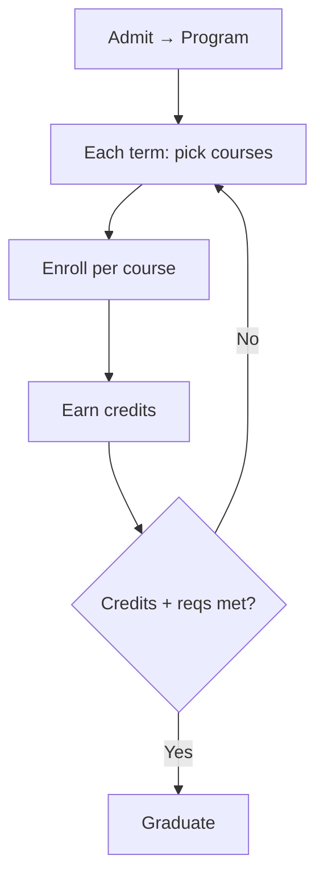
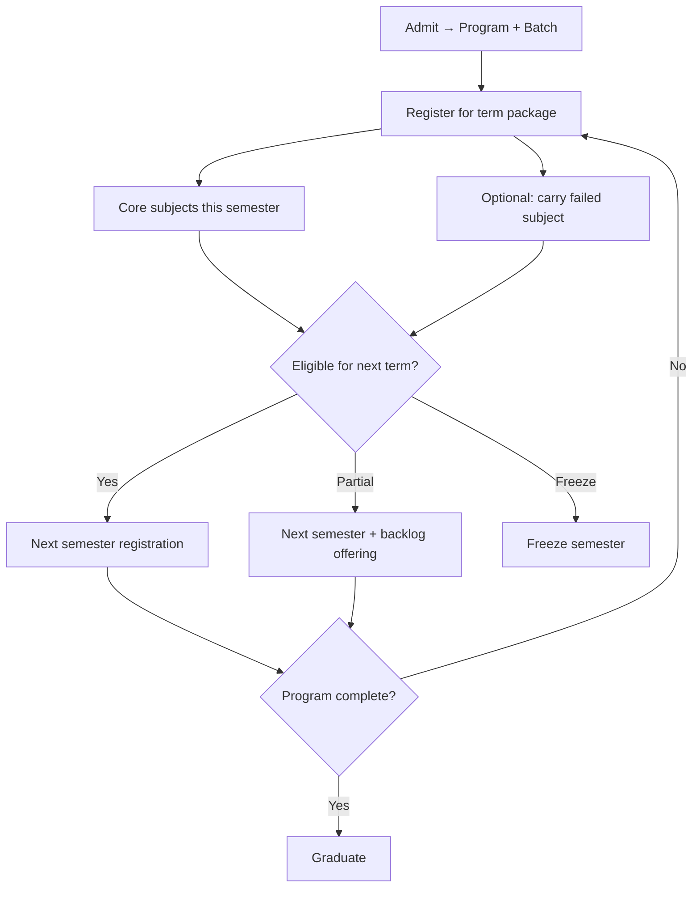
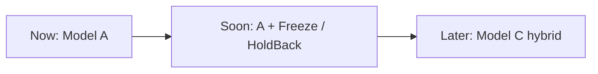

# How universities move students through semesters (worldwide)

> **Purpose:** Simple visual guide to the progression models used most in the world — so we can pick one for ScholarOS.  
> **Not code.** Read this, choose a model, then we implement.  
> **Related:** `academic-architecture-plan.md`, `fee-plan.md`, batch-promotion plan, `ux-setup-scenarios.md`  

---

## One sentence

**A progression model answers:** *When does a student go from Semester N to Semester N+1, and who decides?*

---

## The three models that cover almost everyone



| Model | Where common | Who moves forward | Fits ScholarOS today? |
|-------|--------------|-------------------|------------------------|
| **A. Cohort / Batch** | Pakistan, India, much of Asia, many public unis | Registrar promotes the **class** after term | **Best match** to your idea |
| **B. Credit / Course** | USA, Canada, many private liberal arts | Student accumulates **credits**; no fixed “Sem 3 class” | Weak fit (we already have Batch + Semester Registration) |
| **C. Hybrid** | Europe (ECTS) + many modern Asian unis | Cohort term + credits / backlog allowed | Good **later** upgrade of A |

---

## Model A — Cohort / Batch (most like your idea)

**Idea:** Students admitted together stay as a **batch**. They take Semester 1 together, then Semester 2 together, and so on.



**How mass registration works**

1. Create offerings for that batch + session + semester.  
2. **Bulk register** the whole batch (not one-by-one).  
3. Teach → exams.  
4. **Promote selected students** to next semester (again bulk).  
5. Unselected = repeat / freeze / left behind.

**Pros:** Simple for registrar; matches fees as “semester package”; attendance/classes are per batch offering.  
**Cons:** Rigid if students want to skip ahead; transfers need exceptions.

**Used by:** Large public universities in South Asia / Middle East; many engineering colleges; your mental model.

---

## Model B — Credit / Course (US-style)

**Idea:** There is no “promote the batch.” Student registers for **individual courses** each term. Graduation = enough credits (+ requirements).



**Pros:** Flexible; mixed-year classrooms OK.  
**Cons:** Heavy advising; package “semester fee” is awkward; our Batch + Semester Registration become less central.

**Used by:** USA / Canada / many modular private universities.

---

## Model C — Hybrid (Europe + modern Asia)

**Idea:** Still a **term/semester** and often a **cohort**, but students can carry **backlog** subjects, take electives, or use ECTS credits. Promotion is “may continue” rather than “must pass everything.”



**Pros:** Realistic for fail/reappear; still supports bulk + fees.  
**Cons:** More rules (eligibility, backlog offerings).

**Used by:** Many EU systems (ECTS), UK modular, improving South Asian unis.

---

## Side-by-side (simple)

```text
                 WHO DECIDES NEXT SEMESTER?
                 ───────────────────────────
Model A Cohort   Registrar checklist after exams
Model B Credit   Student (when they enroll next term)
Model C Hybrid   Rules + registrar (eligible / backlog / freeze)
```

```text
                 WHAT IS “A CLASS”?
                 ──────────────────
Model A          Batch Sem 3 offering (same group)
Model B          Course section (any year students)
Model C          Mostly batch offerings + some backlog sections
```

```text
                 FEES
                 ────
Model A          Semester package (our Semester Registration)
Model B          Per-course tuition
Model C          Package + backlog/extra course fees
```

---

## What ScholarOS already looks like

| We already have | Points toward |
|-----------------|---------------|
| Batch, Program, `currentSemester` | **Model A** |
| Course Offering (subject + batch + session) | **Model A / C** |
| Semester Registration (package + enrollments) | **Model A / C** |
| One-by-one registration UI | Incomplete A (missing bulk + promote) |
| Per-offering enrollment | Also supports B-style exceptions |

So we are **already built for Model A**, with room to grow into **Model C** later (freeze status, backlog, eligibility rules).

---

## Recommendation for ScholarOS



1. **Choose Model A (Cohort / Batch) as the primary model.**  
2. Implement: **bulk open term** + **promote batch** (select who advances).  
3. Keep one-by-one semester registration for exceptions.  
4. Later (optional): freeze requests, fail/backlog rules → Model C without throwing away Batch.

---

## Decision checklist (pick one)

When you are ready, say which line you want:

- [ ] **A — Cohort / Batch** (recommended): bulk register + promote selected students  
- [ ] **B — Credit / Course**: redesign toward per-course registration (big change — not recommended now)  
- [ ] **C — Hybrid now**: A + backlog/eligibility rules in the first build (more work)

---

## Glossary

| Word | Meaning |
|------|---------|
| **Batch / Cohort** | Students who entered together (e.g. BSCS-2024) |
| **Promote** | Move selected students Sem N → Sem N+1 |
| **Freeze** | Skip next semester on purpose; stay on current semester |
| **Hold back** | Not promoted (fail / incomplete) |
| **Backlog** | Failed subject retaken while continuing (Model C) |
| **Semester package** | One bill for the whole term (our Semester Registration) |

---

## Next step

After you tick **A / B / C** above, we implement that model (starting with bulk register + promote if you choose A).
